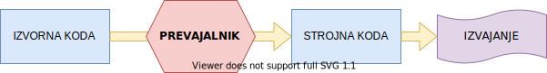
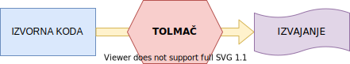

# Uvod v programiranje

## Osnovni pojmi :scroll:

**Računalnik** je sam po sebi dolgočasna in neumna škatla, ki jo programerji želimo ukaniti, da počne nekaj koristnega in/ali zanimivega.

> **Pro&#183;gram&#183;mer** (_noun_)  
> Someone who solves a problem you didn't know you had in a way you don't understand.

### Algoritem

je končno zaporedje natančno določenih, računalniško izvedljivih navodil, običajno namenjenih reševanju problemske domene ali izvajanje izračuna.

> Primer algoritma:
>
> 1. Maslo vsaj 1 uro pred pričetkom postavimo na sobno temperaturo
> 2. V posodo presejemo moko
> 3. K moki presejemo še sladkor v prahu
> 4. Dodamo vaniljev sladkor in ščep soli  
> ...
>
> Rezultat: Linške oči

#### Značilnosti algoritma

- (lahko) sprejme podatke,
- (običajno) vrne rezultat,
- je natančno določen,
- je končen,
- je izvedljiv

#### Zapis algoritma

- v naravnem jeziku (_glej primer zgoraj_)
- grafično z diagramom poteka
- s pomočjo psevdokode
- z definiranim programskim jezikom (Java, Python, C/C++, ...)

### Programski jezik

je človeku razumljiv formalni jezik, ki je sestavlen specifično za implementacijo algoritmov. Definirani so s strogo specifikacijo, ki jim določa **sintakso** (obliko) in **semantiko** (pomen), kar nam omogoča, da jih stroji/računalniki lahko **tolmačijo** in **prevajajo** v **strojno kodo**, ki jo lahko izvedejo.

#### Delitev programskih jezikov

> There are only two kinds of languages: the ones people complain about and the ones nobody uses.  
> \- Bjarne Stroustrup (avtor jezika C++)

Programske jezike kategoriziramo v pet generacij:

1. **Strojni jeziki** (_ang. Machine languages_)
2. **Zbirni jeziki** (_ang. Assembly languages_)
3. **Visoko-nivojski jeziki** (_ang. High-level languages_): C/C++, Java, Python, ...
4. **Domenski jeziki** (_ang. Domain-specific languages_): SQL, MATLAB, LabVIEW, ...  
   jeziki narejeni s specifično aplikacijo v mislih (npr. podatkovne baze, statistična analiza, ...)
5. **Jeziki pete generacije**: Prolog, OPS5, Mercury, ...  
   jeziki, ki temeljijo na reševanju problemov na osnovi podanih meja, namesto algoritmov

Kot bomo kasneje spoznali, lahko programske jezike razdelimo glede na mnogo različnih faktorjev, generacije so samo eden od bolj splošnih.

## Prevajanje in tolmačenje

Kot smo že omenili, računalniki in drugi stroji ne govorijo programskih jezikov v isti obliki kot mi. Da jih razumejo, jih moramo najprej pretvoriti v njim razumljivo obliko, tj. **strojni jezik**. To v osnovi naredimo s prevajalnikom ali tolmačem.

### Prevajalnik (_ang. compiler_)

je program, ki **prevede kodo** iz enega programskega jezika v drugega. Običajno jezik višjega nivoja prevajamo v jezik nižjega nivoja. Običajno je ciljni jezik strojni jezik, vendar obstajajo izjeme in tudi primeri, kjer tega morda nebi želeli.

Nekateri poznani programski jeziki, ki se prevajajo so: C/C++, C#, Rust, Fortran, ...

> Obstajajo tudi programi, ki prevajajo jezike nižjega nivoja v jezike višjega nivoja, ki jih imenujemo **povratni prevajalniki** (_ang. decompiler_).

### Tolmač (_ang. interpreter_)

je program, ki **direktno izvaja kodo**, brez da bi jo najprej prevedel v strojni jezik. To lahko izvede na več različnih načinov, kot sta naprimer sprotno prevajanje in izvajanje kode ki je zapečena v tolmač (tj. vnaprej prevedena).

Nekateri poznani programski jeziki, ki se tolmačijo so: Python, JavaScript, Lua, Ruby, ...

