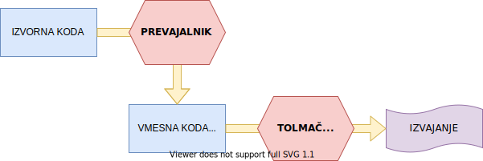

# Java :coffee:

> Java is a **high-level**, **class-based**, **object-oriented** programming language that is designed to have as few implementation dependencies as possible. It is a general-purpose programming language intended to let application developers _write once, run anywhere_ (WORA), meaning that compiled Java code can run on all platforms that support Java without the need for recompilation.
>
> Vir: [Wikipedia](https://en.wikipedia.org/wiki/Java_(programming_language))

**Opomba:** Objektno orientirano programiranje (oz. _OOP_) bomo spoznali v kasnejšem poglavju!

## Uvod v Javo

### Izvajanje programa

Iz prejšnjega poglavja vemo, da moramo izvorno kodo našega programa pretvoriti v strojno kodo, kar lahko naredimo s prevajalnikom ali tolmačem.

Java je v tem primeru obrala hibridni pristop. Izvorna koda se s prevajalnikom prevede v vmesno kodo, ki se imenuje **Bytecode**. Bytecode pa je neke vrste strojna koda za **Java Virtual Machine** oz. **JVM**, ki jo nato interpretira in izvede na sistemu.



Na ta način Java doseže **popolno prenosljivost**. Ko je program preveden v Bytecode, se lahko ta prenese na kater koli sistem, ki podpira JVM, in se na njem interpretira oz. izvede.

### Namestitev Jave

1. Prenesemo in namestimo Java JDK (_Java Development Kit_)  
   - Oracle: [prenos](https://www.oracle.com/java/technologies/javase-jdk11-downloads.html) (trenutno na voljo samo z registracijo)  
   - AdoptOpenJDK: [prenos](https://adoptopenjdk.net/)
2. Nastavimo spremenljivke okolja (Windows) [samo če smo namestili Oracle verzijo]  
   - ustvarimo spremeljivko `JAVA_HOME` z vrednostjo: `[lokacija namestitve]`  
   - obstoječi spremenljivki `PATH` dodamo vrednost: `%JAVA_HOME%\bin`

### Prvi program

Program napišemo v datoteko `HelloWorld.java`:

```java
class HelloWorld {
	public static void main (String[] args) {
		System.out.println("Hello, World!");
	}
}
```

#### Prevajanje

Program bomo prevedli v ukazni vrstici s pomočjo programa `javac` oz. _Java compiler_.

Izvedemo ukaz `javac HelloWorld.java`,  
kar nam ustvari novo datoteko `HelloWorld.class`. To je naša vmesna koda oz. **Bytecode**.

#### Izvajanje

Sedaj ko smo program prevedli smo pripravljeni na izvajanje. Tokrat bomo uporabili program `java`, ki program izvede v Javinem tolmaču.

Izvedemo ukaz `java HelloWorld`,  
kar nam bo v ukazno vrstico izpisalo `Hello, World!`. Uspešno smo izvedli naš prvi program.

**POZOR:** Pri izvajanju navajamo ime razreda `HelloWorld` in ne datoteke `HelloWorld.class`, kjer se prevedeni razred nahaja.
