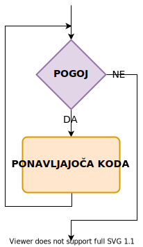
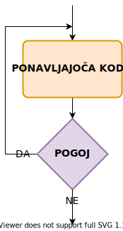

# Zanke

Zanke so zaporedja ukazov, ki se ponavljajo dokler ne dosežemo nekega pogoja. To je v računalništvu zelo pogosto uporabno, saj podatke načeloma organiziramo v strukture zaporedne narave, ki jih običajno procesiramo v ponavljajočih se postopkih.

Spoznali bomo tri različne stavke, ki so namenjene ponovitvam iste kode - WHILE, DO-WHILE in FOR. Pri pogojih za izvajanje teh zank pa uporabljamo enake pogojne operatorje kot pri pogojnih stavkih.

Pri vseh oblikah definiramo kontrolni blok oz. pogoj in telo zanke, kjer navedemo kodo za ponavljajoče izvajanje.

## Zanka WHILE

Zanka **WHILE** je najbolj preprosta izmed vseh, saj pred vsakim izvajanjem zanke preprosto preveri pogoj v kontrolnem bloku in nato izvede kodo.



Kot bomo videli v primeru, telo zanke običajno direktno vpliva na spremenljivke v pogoju.

```java
int stevec = 0;

while (stevec < 10) {
	System.out.println(stevec);
	stevec++;
}
```

## Zanka DO-WHILE

Zanka **DO-WHILE** je zelo podobna zanki WHILE, le da pogoj preveri po izvedbi zanke. Torej ni mogoče, da se zanka izvede manj kot 1x.



V primeru demonstriramo uporabnost te posebne lastnosti v primerjavi z WHILE zanko:

```java
int stevec = 5;

do {
	System.out.println(stevec);
	stevec--;
} while (stevec < 5 && stevec >= 0);
```

## Zanka FOR

Stavek **FOR**, pa doda posebne opcije v kontrolni blok. Dovoli nam, da v kontrolnem bloku določimo tri druge bloke, ki bolj specifično določijo izvajanje zanke.

Diagram zanke je torej isti kot pri WHILE, drugačna je glava:  
`for (inicializacijski blok; pogojni blok; izvrševalni blok)`

- inicializacijski blok: postavi spremenljivke za zanko
- pogojni blok: določi pogoj za izvajanje kode v zanki
- izvrševalni blok: omogoča navedbo stavkov, ki se izvedejo po vsakem izvajanju kode

Inicializacijski in izvrševalni blok lahko vsebujeta več stavkov, ki so izjemoma ločeni z vejico. Lahko pa posamezen blok pustimo tudi prazen.

Poglejmo si spet primer iz prve naloge, zapisan s FOR zanko.

```java
for (int stevec = 0; stevec < 10; stevec++) {
	System.out.println(stevec);
}
```

Opazimo, da je ta zapis veliko bolj kompakten kot prejšnji, saj vse potrebno za nadziranje zanke nastavimo v kontrolnem bloku / glavi.

**POZOR!** Prazen pogojni blok se smatra kot izpolnjen pogoj.

## Prekinitve

Ko želimo prekiniti izvajanje zanke iz bloka, ki ji pripada, lahko to naredimo na enega izmed dveh načinov. Za popoln izhod lahko uporabimo stavek `break`, za skok na naslednjo iteracijo pa stavek `continue`.

V primeru bomo uporabili stavek `continue`, da preskočimo izvajanje iteracij, kjer je števec liho število, in stavek `break`, da zapustimo zanko ko dosežemo število 20.

```java
for (int stevec = 0; ; stevec++) {
	if (stevec % 2 != 0)
		continue;
	
	if (stevec > 20)
		break;

	System.out.println(stevec);
}
```

## Gnezdenje

Konceptu pisanja zanke znotraj zanke, se imenuje gnezdenje zank. Uporabno je za več dimenzionalne podatke, kot so tabele.

Primer gnezdenja, da narišemo smreko iz zvezdic.

```java
int n = 10;

for (int i = 0; i < n; i++) {
	for (int j = 0; j < n - i - 1; j++)
		System.out.print(" ");
	for (int j = 0; j < 2 * i + 1; j++)
		System.out.print("*");
	System.out.println();
}
```
